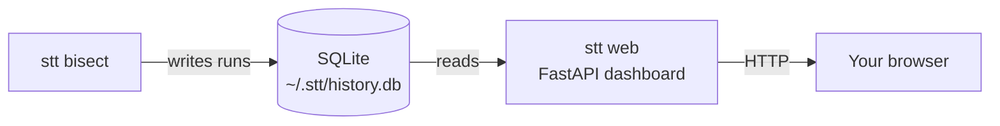

# Dashboard guide

A focused walkthrough of the `stt` web dashboard — what it shows, how to launch it, where its data comes from, and how to populate it manually for demos.

> **For the project as a whole, see [README.md](README.md).** This file is just the dashboard.

---

## Contents

1. [What the dashboard is](#what-the-dashboard-is)
2. [Quick start](#quick-start)
3. [`stt web` flags](#stt-web-flags)
4. [Pages explained](#pages-explained)
5. [Where the data comes from](#where-the-data-comes-from)
6. [Schema reference](#schema-reference)
7. [Manually inserting data (for demos / testing)](#manually-inserting-data-for-demos--testing)
8. [JSON API endpoints](#json-api-endpoints)
9. [Resetting the database](#resetting-the-database)
10. [Troubleshooting](#troubleshooting)

---

## What the dashboard is

`stt` records every test run it performs (during a `bisect`) into a small SQLite database on your machine. The dashboard is a **read-only web view** over that database — you can browse which tests have been run, which are currently failing, and the per-commit history of any individual test.

It's not a service. It's not multi-user. It's a local browser-based way to look at your bisect history without grepping `stt history` in a terminal.



---

## Quick start

```bash
# 1. Install the optional web extras (FastAPI + uvicorn + Jinja2)
pip install -e ".[web]"

# 2. Launch the dashboard
stt web

# 3. Open the URL it prints (default: http://127.0.0.1:8765)
```

If the dashboard is empty, that's expected — you haven't run a `stt bisect` yet. Either:

- Run a real bisect (see the main README's quick start), or
- Seed sample data manually (see [below](#manually-inserting-data-for-demos--testing))

---

## `stt web` flags

| Flag | Default | What it does |
|---|---|---|
| `--host` | `127.0.0.1` | Network interface to bind. Use `0.0.0.0` to make the dashboard reachable from another machine on your LAN. |
| `--port` | `8765` | TCP port. Change if `8765` is taken. |
| `--db` | `~/.stt/history.db` | Path to the SQLite history file. Useful if you keep multiple separate histories. |

Examples:

```bash
stt web --port 9000
stt web --host 0.0.0.0 --port 9000      # accessible on LAN
stt web --db /tmp/scratch-history.db    # use a different DB
```

---

## Pages explained

### `/` — Dashboard

The entry point. Shows three things:

1. **Stats row** — number of tests being tracked, how many are currently failing ("red"), and how many recent runs are shown.
2. **Tests table** — one row per `(repo, test_id)` ever recorded, with a red/green pill, total run count, fail rate %, and last-run timestamp. Click a test name to drill into its history.
3. **Recent runs feed** — the last 50 runs across all tests and repos, newest first.

### `/test?repo=…&test=…` — Per-test history

Reached by clicking a test name from the dashboard. Shows:

1. The repo path and test ID at the top.
2. **Last passing commit** — the SHA `stt bisect` will use as `--good` if you don't pass one.
3. **Timeline** — colored squares (green = pass, red = fail), oldest on the left, newest on the right. Hover for details.
4. **Full run history** — table of every recorded run for this test.

### `/docs` — API docs

Auto-generated [Swagger UI](https://swagger.io/tools/swagger-ui/) showing every JSON endpoint with try-it-now forms. Useful if you want to script against the dashboard or integrate it with another tool.

The site nav (Home / API docs / GitHub) is rendered above Swagger UI so you can always get back.

---

## Where the data comes from

**One file**: `~/.stt/history.db` (a SQLite database).

Anything that writes to that file shows up in the dashboard on the next page refresh. The two ways data gets in:

### 1. `stt bisect` (the normal way)

Every commit `stt` checks out during a bisect produces one row: `(repo, test_id, sha, passed, timestamp)`. So a 5-iteration bisect produces 5 rows. After enough bisects you'll have a real history per test.

```bash
# After this command, the dashboard will show rows for every commit it tested
stt bisect --repo /path/to/your/repo \
           --good HEAD~50 \
           --test tests/test_x.py::test_y
```

### 2. Direct insert (for demos and testing)

You can write to the database from Python directly using `Storage.record(...)`. See [Manually inserting data](#manually-inserting-data-for-demos--testing).

### What the dashboard does **not** do

- It doesn't watch external repos.
- It doesn't poll CI.
- It doesn't run tests on its own.
- It doesn't trigger bisects (yet — that's a roadmap item).

It's a viewer. The CLI does the work; the dashboard shows the result.

---

## Schema reference

Single table: `test_runs`.

| Column | Type | Meaning |
|---|---|---|
| `id` | integer (PK) | Autoincrement; not surfaced in the UI |
| `repo` | text | Absolute path of the repo `stt bisect` was run against |
| `test_id` | text | The test identifier — for pytest, this is `path/to/test.py::test_name` |
| `sha` | text | Full git commit SHA the test was run against |
| `passed` | integer (0/1) | 1 if the test passed, 0 if it failed |
| `timestamp` | text (ISO 8601 UTC) | When this run was recorded |

Indexed on `(repo, test_id, timestamp DESC)` for the per-test history queries. Schema lives in [`stt/storage.py`](stt/storage.py).

The dashboard derives a couple of fields on top:

- **`currently_red`** — `True` if the most recent run for this `(repo, test_id)` was a fail.
- **`fail_rate`** — `(failures / total runs)` for this `(repo, test_id)`.

---

## Manually inserting data (for demos / testing)

Useful when you want to demo the dashboard without doing a real bisect first, or when writing tests against the API.

### One-shot Python

```python
from stt.storage import Storage

s = Storage()  # opens ~/.stt/history.db, creating it if needed

# record(repo, test_id, sha, passed)
s.record("/Users/me/projects/billing", "tests/test_billing.py::test_total", "a1b2c3d4", True)
s.record("/Users/me/projects/billing", "tests/test_billing.py::test_total", "b2c3d4e5", False)
s.record("/Users/me/projects/billing", "tests/test_billing.py::test_total", "c3d4e5f6", False)
```

Refresh the dashboard — the rows appear.

### Realistic seed (with backdated timestamps)

If you want the timeline to look like it spans hours/days instead of milliseconds, bypass `record()` and insert directly:

```python
import sqlite3
from datetime import datetime, timedelta, timezone
from stt.storage import DEFAULT_DB_PATH

now = datetime.now(timezone.utc)

def insert(repo, test_id, sha, passed, minutes_ago):
    ts = (now - timedelta(minutes=minutes_ago)).isoformat()
    with sqlite3.connect(DEFAULT_DB_PATH) as conn:
        conn.execute(
            "INSERT INTO test_runs (repo, test_id, sha, passed, timestamp) "
            "VALUES (?, ?, ?, ?, ?)",
            (repo, test_id, sha, int(passed), ts),
        )

# Three passes then three fails — looks like a real regression bisect
proj = "/Users/me/projects/billing"
test = "tests/test_billing.py::test_invoice_total"
for sha, passed, ago in [
    ("aaa1", True,  330),
    ("bbb2", True,  300),
    ("ccc3", True,  270),
    ("ddd4", False, 240),
    ("eee5", False, 210),
    ("fff6", False, 180),  # this is the bad commit
]:
    insert(proj, test, sha, passed, ago)
```

---

## JSON API endpoints

All endpoints are read-only and return JSON. Open `/docs` for an interactive Swagger UI, or hit them with `curl`:

```bash
# Most recent runs across everything (default 50)
curl http://127.0.0.1:8765/api/runs

# Limit results
curl 'http://127.0.0.1:8765/api/runs?limit=10'

# Per-test summary with fail_rate and currently_red
curl http://127.0.0.1:8765/api/tests

# Liveness probe (use this in scripts)
curl http://127.0.0.1:8765/api/health
# → {"status":"ok"}

# Raw OpenAPI 3 schema — feed to code generators, etc.
curl http://127.0.0.1:8765/openapi.json
```

| Endpoint | Returns |
|---|---|
| `GET /api/runs?limit=N` | List of `{repo, test_id, sha, passed, timestamp}` |
| `GET /api/tests` | List of `{repo, test_id, runs, passes, fail_rate, currently_red, last_run_at, last_passed_at, last_failed_at}` |
| `GET /api/health` | `{"status": "ok"}` |
| `GET /openapi.json` | OpenAPI 3 schema for everything above |

---

## Resetting the database

The dashboard never destroys data, but you may want to start fresh for a demo or after testing.

**macOS / Linux:**
```bash
rm ~/.stt/history.db
```

**Windows (PowerShell):**
```powershell
Remove-Item $env:USERPROFILE\.stt\history.db
```

**Windows (Command Prompt):**
```cmd
del %USERPROFILE%\.stt\history.db
```

The next `stt bisect` or `Storage()` call will recreate the file with an empty schema.

---

## Troubleshooting

### `stt: command not found`

The `stt` script lives in your Python user-scripts directory, which may not be on your PATH after `pip install -e .`. Workaround: invoke via the module path.

```bash
python -m stt.cli web
python -m stt.cli bisect --help
```

Or add `python -m site --user-base`'s `Scripts` (Windows) / `bin` (Unix) directory to your PATH.

### `Address already in use` on port 8765

Another process has the port. Pick a different one:

```bash
stt web --port 9000
```

### Dashboard is empty

You haven't recorded any runs yet. Either:

1. Run a real bisect: `stt bisect --good HEAD~10 --test path::name --repo /path/to/repo`
2. Seed sample data — see [Manually inserting data](#manually-inserting-data-for-demos--testing).

### "TypeError: unhashable type: 'dict'" (developer note)

If you see this when starting the server in a fork of the code, you're hitting the old Starlette `TemplateResponse(name, context)` signature. The fix is `TemplateResponse(request, name, context)` — already applied in `stt/web/app.py`.

### Browser can't reach the dashboard from another machine

By default the server binds to `127.0.0.1`, which is loopback only. To expose on the LAN:

```bash
stt web --host 0.0.0.0 --port 8765
```

Then open `http://<your-machine-ip>:8765` from another device on the same network. **Note:** there is no auth on the dashboard. Don't expose it to the public internet.
