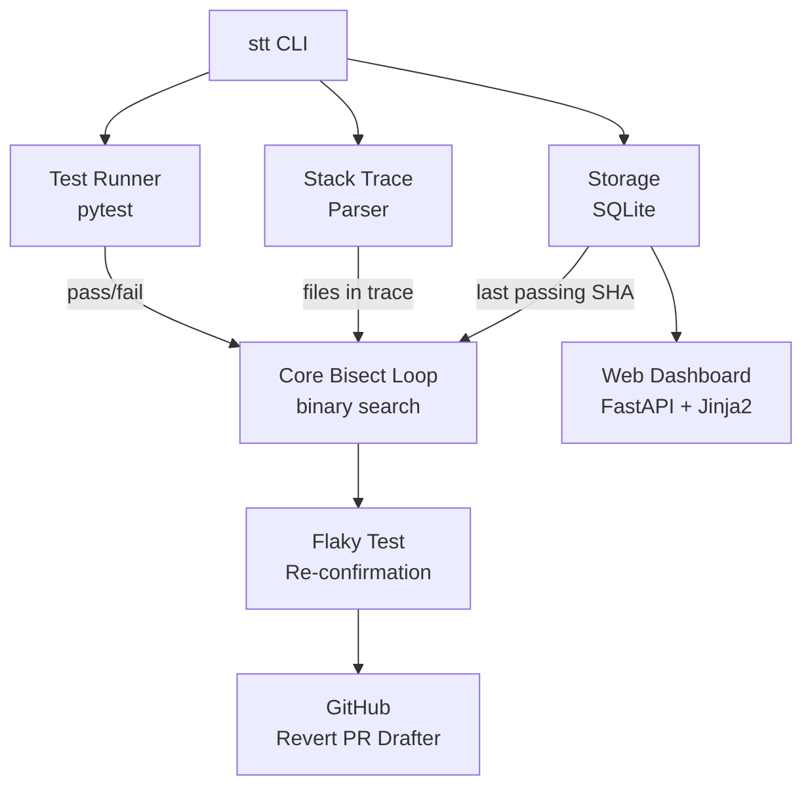

# Stack Trace Time Machine (`stt`)

[](https://github.com/rrathore02/stack-trace-time-machine/actions/workflows/ci.yml)
[](LICENSE)
[](https://www.python.org/downloads/)

> **In one sentence:** when one of your tests starts failing, this tool figures out which of your recent changes caused it — automatically — instead of you doing it by hand.

If some of the words below are unfamiliar (commit, regression, bisect, PR), there's a [glossary at the bottom](#glossary).

---

## The problem this solves

You're working on a codebase. Last week, all the tests passed. Today, one of them is failing. Somewhere in the **50 changes** you and your teammates made in between, **one change broke it.** Which one?

The traditional way to figure this out is `git bisect`: a built-in Git tool that does a binary search through your history. You start it, mark a known-good commit and a known-bad one, and Git keeps jumping you to commits in the middle until it narrows down the culprit. **It works, but you have to manually run the test at every step**, which on a real codebase can take 15 minutes to four hours.

`stt` automates that whole loop:

1. You tell it which test is failing.
2. It bisects history for you, running the test at each step.
3. It uses the failing **stack trace** (the error output) to skip commits that couldn't possibly be the culprit — so it goes ~10× faster on real codebases.
4. It re-runs failures a few times to weed out flaky tests.
5. When it finds the bad commit, it can optionally open a draft pull request that reverts it.

End result: you go from "the test is failing" → "here's the exact commit that broke it" in **one command, in the time it takes to grab coffee.**

---

## Who is this for?

Software developers who work with Git and have a test suite. Especially useful if:

- You work on a busy codebase where main breaks occasionally.
- Your test setup is slow (containers, fixtures, integration tests) — every saved iteration is real time.
- You're tired of running `git bisect` by hand.

Not useful if you're not a developer — there's nothing visual or end-user-facing about this.

---

## What's `git bisect` (in 3 sentences)?

Git tracks every change to your code as a **commit** — a saved snapshot. When something breaks, the bug was introduced in *some* commit. `git bisect` does a binary search through your commit history (split the range in half, test, narrow down) so that with N commits you only need ~log₂(N) test runs to find the bad one — but it makes you run the test manually at each step. `stt` is `git bisect` with the manual part automated and an extra optimization that uses the error output to skip commits that aren't suspects.

---

## Prerequisites

You need these installed on your machine:

| Tool | Version | Why | Install |
|---|---|---|---|
| **Python** | 3.10 or newer | The tool is written in Python | [python.org/downloads](https://www.python.org/downloads/) |
| **Git** | any recent version | The whole point | [git-scm.com/downloads](https://git-scm.com/downloads) |
| **`gh` CLI** | optional | Only needed if you want `stt` to open revert PRs for you | [cli.github.com](https://cli.github.com/) |

To check you have them:

```bash
python --version    # should be 3.10+
git --version       # any version is fine
gh --version        # optional
```

---

## Install

```bash
# 1. Get the code
git clone https://github.com/rrathore02/stack-trace-time-machine.git
cd stack-trace-time-machine

# 2. Install it. The "-e" means "editable" — if you change the source,
#    your installed copy updates automatically. Useful for tinkering.
pip install -e .

# 3. Verify it's on your PATH
stt --help
```

You should see:

```
Usage: stt [OPTIONS] COMMAND [ARGS]...

  Stack Trace Time Machine — find the commit that broke your test.

Commands:
  bisect   Bisect history between GOOD and BAD to find the commit that broke TEST.
  history  Show recent recorded runs for a test.
```

---

## Try it on a fake bug in 30 seconds

The repo includes a tiny demo: a script that creates a throwaway Git repo with a planted bug, then you point `stt` at it.

### Step 1 — seed the demo

**On macOS / Linux / WSL:**
```bash
bash examples/demo_repo/seed.sh /tmp/stt-demo
```

**On Windows (PowerShell):**
```powershell
.\examples\demo_repo\seed.ps1 -Path C:\Temp\stt-demo
```

This creates a small repo with 6 commits. One of them — the one titled `"BUG: change answer to 41"` — broke a test on purpose.

### Step 2 — run `stt` against it

```bash
stt bisect --repo /tmp/stt-demo \
           --good HEAD~5 \
           --test tests/test_compute.py::test_answer
```

(Use `C:\Temp\stt-demo` instead of `/tmp/stt-demo` on Windows.)

### What you'll see

```
Bisecting <good>..HEAD for test 'tests/test_compute.py::test_answer' using pytest
  step 1: <sha> → FAIL
  step 2: <sha> → PASS
  step 3: <sha> → FAIL

First bad commit: <commit SHA>
  iterations: 3

Dry run — pass --open-pr to push a revert branch and open a draft PR.
```

`stt` correctly identifies the planted bad commit in 3 steps. **That's the whole tool, working end-to-end.**

---

## Use it on your own repo

Once you have a failing test in your own project, find a commit you know was healthy (e.g., a tag from your last release, or just `HEAD~50`):

```bash
stt bisect \
  --repo /path/to/your/project \
  --good v1.4.2 \
  --test tests/test_billing.py::test_invoice_total
```

After the first run, `stt` remembers the last commit where each test was green, so you can drop `--good`:

```bash
stt bisect --repo /path/to/your/project --test tests/test_billing.py::test_invoice_total
```

To make it faster on a long history, save the failing test's output to a file and pass `--trace-file`:

```bash
pytest tests/test_billing.py::test_invoice_total 2> failure.log
stt bisect --repo . --test tests/test_billing.py::test_invoice_total --trace-file failure.log
```

That's the **smart bisect** mode — explained below.

---

## Web dashboard (optional)

`stt` ships with a small read-only web dashboard so you can browse your bisect history in a browser instead of by `stt history` calls.

### Install + launch

```bash
pip install -e ".[web]"   # one extra: FastAPI + uvicorn + Jinja2
stt web                   # serves on http://127.0.0.1:8765
```

Open the URL and you'll see:

- **Dashboard (`/`)** — every test you've ever run, with a red/green pill, run count, fail rate, and a feed of the most recent runs
- **Per-test view (`/test`)** — every recorded run for a single test, plus a colored timeline of pass/fail dots (oldest → newest) and the last passing SHA
- **`/api/runs` and `/api/tests`** — same data as JSON
- **`/docs`** — auto-generated Swagger UI from FastAPI

The dashboard reads the same `~/.stt/history.db` the CLI writes to, so anything `stt bisect` records shows up immediately. No separate database, no daemon.

> **For the full guide** — pages explained, schema reference, where the data comes from, how to seed sample data, troubleshooting — **see [DASHBOARD.md](DASHBOARD.md).**

---

## How it works



Each box is a small, decoupled Python module under [`stt/`](stt/). You can swap the test runner, plug in a new stack-trace parser for another language, or skip the GitHub bit entirely.

| Module | What it does |
|---|---|
| [`stt/git_utils.py`](stt/git_utils.py) | Thin wrapper around the `git` command-line tool |
| [`stt/bisect.py`](stt/bisect.py) | The binary-search loop that drives everything |
| [`stt/stack_trace.py`](stt/stack_trace.py) | Pulls source-file paths out of failing-test output |
| [`stt/runners/pytest_runner.py`](stt/runners/pytest_runner.py) | Knows how to invoke pytest and read its result |
| [`stt/storage.py`](stt/storage.py) | Tiny SQLite database remembering past test runs |
| [`stt/flaky.py`](stt/flaky.py) | Re-runs failures to detect flaky tests |
| [`stt/github_integration.py`](stt/github_integration.py) | Builds a revert PR via the `gh` CLI |
| [`stt/web/app.py`](stt/web/app.py) | Optional web dashboard (FastAPI + Jinja2) |
| [`stt/cli.py`](stt/cli.py) | The user-facing command-line interface |

---

## CLI reference

### `stt bisect`

Find the first commit between `--good` and `--bad` where `--test` starts failing.

| Flag | Default | What it does |
|---|---|---|
| `--repo` | `.` | Path to the Git repo to bisect |
| `--good` | last passing SHA from history | Commit reference (SHA, tag, branch) where the test passes |
| `--bad` | `HEAD` | Commit reference where the test fails |
| `--test` | (required) | Test ID, e.g. `tests/test_x.py::test_y` |
| `--runner` | `pytest` | Test framework (more coming) |
| `--trace-file` | — | Path to a file containing the failing stack trace; enables the smart filter |
| `--flaky-runs` | `1` | Re-run apparent failures this many times to weed out flakes |
| `--flaky-threshold` | `0.6` | Fraction of re-runs that must fail to confirm a real failure |
| `--open-pr` | off | Push a revert branch and open a draft PR via `gh` |
| `--pr-base` | `main` | Base branch for the revert PR |
| `--restore/--no-restore` | restore | Put HEAD back where it was when bisect ends |

### `stt history`

Show recent recorded runs for a test.

```
stt history --test tests/test_billing.py::test_invoice_total --limit 10
```

### `stt web`

Launch the read-only web dashboard. Requires `pip install -e ".[web]"`.

| Flag | Default | What it does |
|---|---|---|
| `--host` | `127.0.0.1` | Interface to bind |
| `--port` | `8765` | Port to listen on |
| `--db` | `~/.stt/history.db` | Path to history DB |

---

## The interesting part: smart bisect

A bisect over 200 commits is theoretically only 8 test runs (binary search). But in practice each test run can take minutes — Docker containers spin up, fixtures load, etc. So even an 8-run bisect can be 20-40 minutes.

**Stack-trace-aware filtering** changes the math. Given the failing trace, `stt` extracts the source files involved (skipping standard-library and pytest internals) and only tests commits that touched at least one of those files. On real codebases this typically prunes 80–95% of candidates.

**Tradeoff: it's a heuristic.** A regression caused by a change to a config file or a transitively-imported file that doesn't appear in the trace will be missed and falsely attributed to a later commit. When in doubt, run without `--trace-file`. Implementation in [`stt/bisect.py`](stt/bisect.py) (`make_stack_trace_filter`).

---

## Flaky-test handling

If `stt` trusts a single failure, a 5%-flaky test will make it blame whichever commit happened to fail on the first roll. To avoid this, `--flaky-runs N` re-runs apparent failures up to N times. We only burn extra runs on **failures**, since flakiness is virtually always intermittent failures rather than intermittent passes.

The implementation **short-circuits** as soon as the verdict is unambiguous: with `--flaky-runs 5 --flaky-threshold 0.6`, two passes already make confirmation impossible, so we stop after run 2. Code in [`stt/flaky.py`](stt/flaky.py).

---

## Limitations / non-goals

These are deliberate, not bugs.

- **Linear history only.** Bisecting through merge commits gets philosophically interesting (which side of the merge is "bad"?) and `stt` doesn't try.
- **One failing test at a time.** If your suite has multiple regressions in one push, run `stt` per test.
- **Pytest only (today).** The runner abstraction is in place; Jest, Go, and Rust runners are easy adds — see [`stt/runners/base.py`](stt/runners/base.py).
- **Stack-trace filter is a heuristic.** See above. Skip it when in doubt.
- **No parallel bisect.** Using `git worktree` would let us test commits in parallel — would roughly halve wall time. On the roadmap.

---

## What I'd build next

- **`git worktree`-based parallel bisect.** Run two candidate commits concurrently — biggest remaining lever on wall time.
- **Jest and Go runners.** Trivial extensions of the runner abstraction.
- **CI integration.** A GitHub Action that triggers on red `main`, runs `stt`, and comments on the offending PR with a link to the revert.
- **Verify-before-revert.** Before opening a revert PR, run the full test suite on the proposed revert branch — don't blindly revert.
- **Web dashboard.** Show in-progress bisects and a history of caught regressions across a fleet of repos.

---

## Development

```bash
pip install -e ".[dev,web]"
pytest -q
```

29 tests. The bisect tests build a real throwaway Git repo so the binary search exercises real `git rev-list` and `git checkout` calls — not mocks. Web tests use FastAPI's `TestClient` to hit every route end-to-end.

CI runs the same tests on every push against Python 3.10, 3.11, and 3.12.

---

## License

MIT. See [LICENSE](LICENSE).

---

## Glossary

For readers new to Git / GitHub:

- **Commit** — a saved snapshot of your code, with a message describing what changed. Every commit has a unique ID called a "SHA" (e.g. `abc123de`).
- **Branch** — a named line of development. `main` is the default branch; you'd create a "feature branch" to work on something new without disturbing `main`.
- **HEAD** — Git's name for "the commit you have checked out right now." `HEAD~50` means "50 commits before HEAD."
- **Repo / repository** — a project tracked by Git. The thing you `git clone`.
- **Regression** — a bug introduced by a change to code that previously worked. A test that was passing and is now failing is a regression.
- **`git bisect`** — Git's built-in tool for binary-searching commit history to find which commit introduced a bug. `stt` automates the manual parts.
- **CI (Continuous Integration)** — a system that automatically runs your tests every time someone pushes code. The green ✅ badge at the top of this README is from CI.
- **PR / Pull Request** — on GitHub, a proposed change to a repo. Someone opens a PR with their changes, others review and approve, then it gets merged into `main`.
- **Stack trace** — the multi-line error output you get when code crashes, showing which functions were running and where the error happened.
- **Flaky test** — a test that sometimes passes and sometimes fails for the same code, usually due to timing, randomness, or external dependencies. Annoying.
